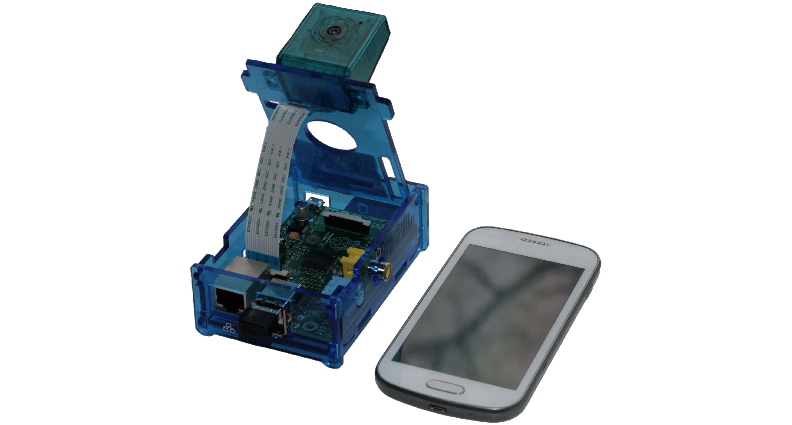
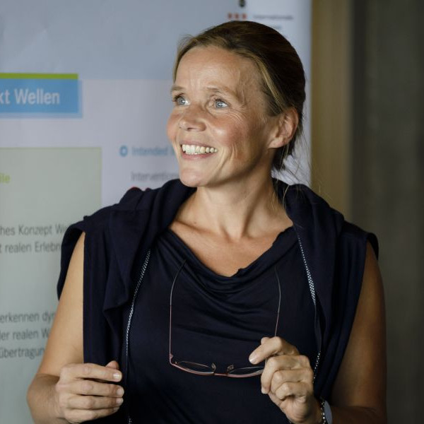

# fields of interest

* numerical mathematics in particular 
* finite element methods to solve
* partial differential equations which describe different physical processes. 
* my strong interest is currently focused on 
  * the calculation of pedestrian flow, based on a macroscopic modeling
  * mathematical methods of image processing

# current projects

* [pFLowSIM](http://www-home.htwg-konstanz.de/~raxthelm/pFlow14.php)  - partial differential equation for pedestrian movement, ongoing since 2014 (currently unfunded)
* [Cman](https://seamless-learning.eu/en/projekte/cman)  - subproject in the [IBH-Lab "Seamless Learning"](http://www.bodenseehochschule.org/ibh-labs/ibh-lab-seamless-learning/), 2018 - 2020
  - [Cman_event](http://www.xthelm.de/Cman): some learning object units
  - Cman_math: there is nothing to see yet
* [BiLeSA](https://seamless-learning.eu/en/projekte/bilesa/)  - subproject in the IBH-Lab "Seamless Learning", 2018 - 2020 
  - [BiLeSA_PDE](https://padlet.com/rebekka_axthelm/BiLeSA): some learning object units
  - BiLeSA_HOM: there is nothing to see yet
* [Knowledge Stories](https://www.bodenseehochschule.org/projects/knowledge-stories-nachwuchsgewinnung-in-der-wissenschaft) Recruiting Young Scientists - Development, Survey and Testing multimodal knowledge communication, 2019

# past projects 

* [pi-Vision](http://www-home.htwg-konstanz.de/~raxthelm/piVision.php): Gesichtserkennung auf dem Raspberry Pi (ZHAW interne Sonderfinanzierung, 2014)
* ... to be continued 

<!--
<table border="0" cellpadding="0" valign="top" >
  	 <tr>
	 <td></td>
         <td align="left"> [pi-Vision](http://www-home.htwg-konstanz.de/~raxthelm/piVision.php): Gesichtserkennung auf dem Raspberry Pi (ZHAW interne Sonderfinanzierung, 2014)
	 </td>
	 </tr>	 
 </table>
-->

# news

* [IN Jahresrückblick 2019](https://www.htwg-konstanz.de/fileadmin/pub/fk_in/News/Newsletter/Jahresrueckblick_Fakultaet-Informatik_HTWG-Konstanz_2019.pdf)

# presentations

* [191127 - Vortragsreihe Mathematik](http://www-home.htwg-konstanz.de/~raxthelm/News/Plakat_INMVortrag_WS1920.pdf) - Simulation von Personenströmen als Kontinuum bei Großanlässen und dichtem Personenverkehr
* [190704 - KI-Thementag](https://www.htwg-konstanz.de/hochschule/fakultaeten/informatik/uebersicht/informatik-news-alle-nachrichten/news/thementag-ki-informatik-zeigt-was-sie-zu-bieten-hat/) - Künstliche Intelligenz, Algorithmik und Digitalisierung an der HTWG
* [190604 - Lehr-Werkstatt](https://www.htwg-konstanz.de/hochschule/lehre-und-qualitaetsmanagement/lehrwerkstatt/) - Seamless Learning 

# teaching
## lessons 
### AIN (bachelor)
* Mathe 1 (Lineare Algebra)
* Mathe 2 (Analysis)
* Signale, Systeme und Sensoren

### MSI (master)
* Numerische Mathematik

(The lecture materials will be provided on moodle.)

## teamprojects (ba)
* WiSe 19/20: "PiLadies" (in progress)
* SoSe 19:
  * ["Color your foto"](http://www-home.htwg-konstanz.de/~raxthelm/presentations/Color_TP_SoSe19.pdf)
* WiSe 18/19: 
  * ["pFlow for different operating systems"](http://www-home.htwg-konstanz.de/~raxthelm/presentations/pFlow_TP_WiSe1819.pdf)
  * ["Book-Writer software"](http://www-home.htwg-konstanz.de/~raxthelm/presentations/Book_TP_WiSe1819.pdf)
* SoSe 18: 
  * "Duisburg 2010"
  * ["virtual reality for the flow of people"](http://www-home.htwg-konstanz.de/~raxthelm/videos/VR_mobile.mp4)
  

## supervised scientific works
["If you are looking for supervision of a thesis, read this document first."](http://www-home.htwg-konstanz.de/~raxthelm/documents/BaMa.pdf)

### bachelor thesis
* SoSe 19: "Synthese eines auf einem Polynom basierenden Sinusgenerators auf einem FPGA." (C. Kaiser)

### master thesis
* WiSe 18/19: "Untersuchung verschiedener Methoden zur Detektion von Ablaufprozessen in der Waferproduktion" (M. Leippert)

# about me / contact

["May I introduce myself? (german)"](https://youtu.be/TVqQ4RQWVg4)

<table border="0"><tr><td  valign="center">
Rebekka Axthelm  
Hochschule Konstanz  
Fakultät Informatik  
Alfred-Wachtel-Straße 8  
78462 Konstanz  
Tel.: +49 7531 206-503   
rebekka.axthelm@htwg-konstanz.de
 </td><td valign="center">

  </td>
 </tr>
 </table>

as you can see: this site is under construction ... 8-]
