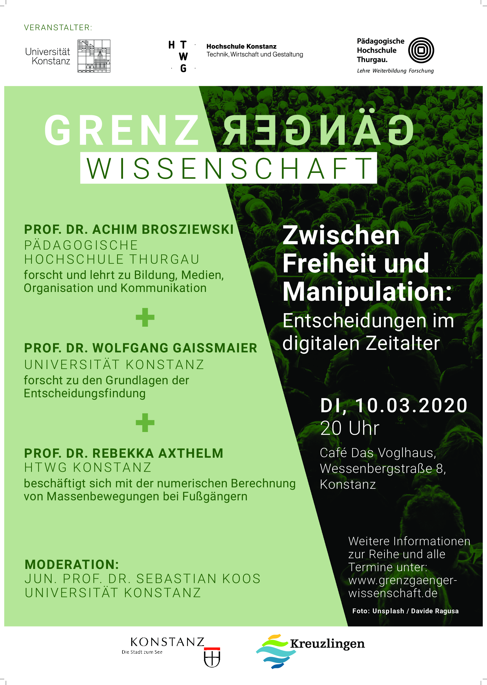
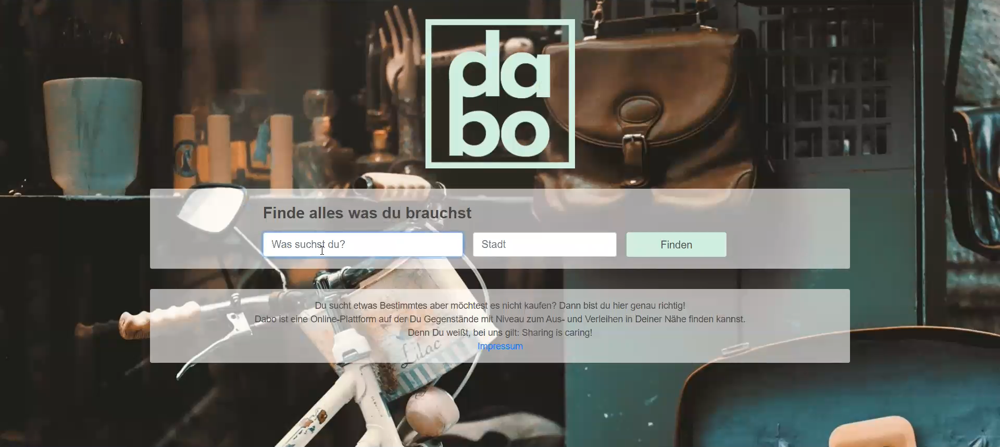

# contact

Prof. Dr. Rebekka Axthelm 
Hochschule Konstanz  
Fakultät Informatik  
Alfred-Wachtel-Straße 8  
78462 Konstanz  
Tel.: +49 7531 206-503   
rebekka.axthelm@htwg-konstanz.de

* [Vice Director of IOS](https://www.ios.htwg-konstanz.de){:target="_blank"}
* [Vice Equal Opportunity Commissioner of the University](https://www.htwg-konstanz.de/hochschule/gleichstellung-und-diversity/ansprechpersonen/){:target="_blank"}	

# fields of interest

* numerical mathematics in particular 
* finite element methods to solve
* partial differential equations which describe different physical processes. 
* my strong interest is currently focused on 
  * the calculation of pedestrian flow, based on a macroscopic modeling
  * mathematical methods of image processing
  * epidemic modeling, coupled with pedestrian flow

# current projects

* [pFLowSIM](http://www-home.htwg-konstanz.de/~raxthelm/pFlow14.php)  - partial differential equation for pedestrian movement, ongoing since 2014 (currently unfunded)
* [Cman](https://seamless-learning.eu/en/projekte/cman)  - subproject in the [IBH-Lab "Seamless Learning"](http://www.bodenseehochschule.org/ibh-labs/ibh-lab-seamless-learning/), 2018 - 2020
  - [Cman_event](http://www.xthelm.de/Cman): some learning object units
  - Cman_math: there is nothing to see yet
* [BiLeSA](https://seamless-learning.eu/en/projekte/bilesa/)  - subproject in the IBH-Lab "Seamless Learning", 2018 - 2020 
  - developed learning [BiLeSA App](https://drive.google.com/file/d/1wsQC2mxHmsmyRJWWEOdQKbu1a6goWLIp/view?usp=sharing)
  - [BiLeSA_PDE](https://padlet.com/rebekka_axthelm/BiLeSA): some learning object units
  - BiLeSA_HOM: there is nothing to see yet

# past projects 

* [Knowledge Stories](https://www.bodenseehochschule.org/projects/knowledge-stories-nachwuchsgewinnung-in-der-wissenschaft) Recruiting Young Scientists - Development, Survey and Testing multimodal knowledge communication, 2019. lead: [ZHAW](https://www.zhaw.ch/no_cache/de/forschung/forschungsdatenbank/projektdetail/projektid/2676/), results and documentation: [videos](https://knowledgestories.ibh.hs-furtwangen.de/)
* [pi-Vision](http://www-home.htwg-konstanz.de/~raxthelm/piVision.php): Gesichtserkennung auf dem Raspberry Pi (ZHAW interne Sonderfinanzierung, 2014)
* ... to be continued 

<!--
<table border="0" cellpadding="0" valign="top" >
  	 <tr>
	 <td></td>
         <td align="left"> [pi-Vision](http://www-home.htwg-konstanz.de/~raxthelm/piVision.php): Gesichtserkennung auf dem Raspberry Pi (ZHAW interne Sonderfinanzierung, 2014)
	 </td>
	 </tr>	 
 </table>
-->

# news

* [Grenzgänger Wissenschaft 10.03.2020](https://www.grenzgaenger-wissenschaft.de/termine/veranstaltungen/2020/3/10/event/37043-Grenzgnger-Wissenschaft-/tx_cal_phpicalendar/)   (auf unbekannten Termin verschoben)
	<!--auf unbekannten Termin verschoebn!  
	<!---->

* [IN Jahresrückblick 2019](https://www.htwg-konstanz.de/fileadmin/pub/fk_in/News/Newsletter/Jahresrueckblick_Fakultaet-Informatik_HTWG-Konstanz_2019.pdf)

# presentations

* [191127 - Vortragsreihe Mathematik](http://www-home.htwg-konstanz.de/~raxthelm/News/Plakat_INMVortrag_WS1920.pdf) - Simulation von Personenströmen als Kontinuum bei Großanlässen und dichtem Personenverkehr ([vertonte Präsentation:](https://www.youtube.com/watch?v=I32QIwL4OCc&feature=youtu.be))
* [190704 - KI-Thementag](https://www.htwg-konstanz.de/hochschule/fakultaeten/informatik/uebersicht/informatik-news-alle-nachrichten/news/thementag-ki-informatik-zeigt-was-sie-zu-bieten-hat/) - Künstliche Intelligenz, Algorithmik und Digitalisierung an der HTWG
* [190604 - Lehr-Werkstatt](https://www.htwg-konstanz.de/hochschule/lehre-und-qualitaetsmanagement/lehrwerkstatt/) - Seamless Learning 

# teaching
## lessons 
### AIN (bachelor)
* Mathe 1 (Lineare Algebra)
* Mathe 2 (Analysis)
* Signale, Systeme und Sensoren
* Stochastik

### MSI (master)
* Numerische Mathematik

(The lecture materials will be provided on moodle. )

## teamprojects (ba)

Heading

<ul>
<li>SoSe 2020:
<ul>
<li>pFlow - pedestrian counting App & CAD Domain-Designer</li>
<li>Verleihplattform      ["video presentation"](https://video.htwg-konstanz.de/Panopto/Pages/Viewer.aspx?id=c46d2bb2-95e2-4406-9691-ac67010829cb)</li>
</ul>
</li>
<li>WiSe 19/20:</li>
</ul>

* SoSe 2020:
  * pFlow - pedestrian counting App & CAD Domain-Designer
  * Verleihplattform      ["video presentation"](https://video.htwg-konstanz.de/Panopto/Pages/Viewer.aspx?id=c46d2bb2-95e2-4406-9691-ac67010829cb)
  
* WiSe 19/20: 
  * ["PiLadies"](http://www.isted.eu)
* SoSe 19:
  * ["Color your foto"](http://www-home.htwg-konstanz.de/~raxthelm/presentations/Color_TP_SoSe19.pdf)
* WiSe 18/19: 
  * ["pFlow for different operating systems"](http://www-home.htwg-konstanz.de/~raxthelm/presentations/pFlow_TP_WiSe1819.pdf)
  * ["Book-Writer software"](http://www-home.htwg-konstanz.de/~raxthelm/presentations/Book_TP_WiSe1819.pdf)
* SoSe 18: 
  * "Duisburg 2010"
  * ["virtual reality for the flow of people"](http://www-home.htwg-konstanz.de/~raxthelm/videos/VR_mobile.mp4)
  
 ## teamprojects (msi)
* SoSe 2020:
  * Epidemie-Modellierung (in progress)
  
## supervised scientific works
["If you are looking for supervision of a thesis, read this document first."](http://www-home.htwg-konstanz.de/~raxthelm/documents/BaMa.pdf)

### bachelor thesis
* SoSe 20: "Physical Modelling and Simulation of Pedestrian Flow Using the Finite Element Method." (A. Moser, S. Rufener, ZHAW Winterthur) [second advisor]
* SoSe 20: "Methoden der Bildverarbeitung zur Erkennung von Objektfehlern innerhalb von Ringstrukturen." (J. Kaiser)
* SoSe 19: "Synthese eines auf einem Polynom basierenden Sinusgenerators auf einem FPGA." (C. Kaiser) [second advisor]

### master thesis
* WiSe 18/19: "Untersuchung verschiedener Methoden zur Detektion von Ablaufprozessen in der Waferproduktion" (M. Leippert)

# about me

## May I introduce myself? (german)
  
<iframe width="800" height="450" src="https://www.youtube.com/embed/px_7Kniswso" frameborder="0" allow="accelerometer; autoplay; encrypted-media; gyroscope; picture-in-picture" allowfullscreen></iframe>

## Blog

<iframe width="800" height="450" src="https://edi-rebekka.blogspot.de" frameborder="0" allowfullscreen=""></iframe>
