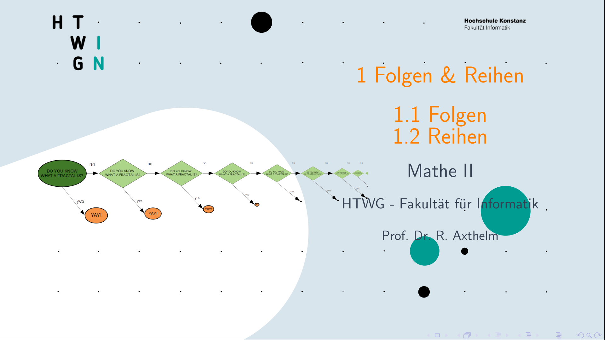

# Mathematik 1 - Lineare Algebra

* Mengen
  * Übungen
  * Quizzes
* Relationen
* etc... 
* [lessons](https://video.htwg-konstanz.de/Panopto/Pages/Viewer.aspx?id=0dbd7714-35ce-4c28-9c86-ac0d0154a590)

# Mathematik 2 - Analysis

||||||
|:.:|:.:|:.:|:.:|
|<em>01_FolgenUndReihen.pdf</em>|<em>01_FolgenUndReihen.pdf</em>|<em>01_FolgenUndReihen.pdf</em>|<em>01_FolgenUndReihen.pdf</em>|
|:.:|:.:|:.:|:.:|

| Rebekka Axthelm | pic |   |   |   |
|:---------------:|:---:|:-:|:-:|:-:|
|       bla       |     |   |   |   |
|                 |     |   |   |   |
|                 |     |   |   |   |

# hilfreiche, weiterführende Links

* [extremstark.de](http://www.extremstark.de/): Abi**
* Thomas' [mathe-seiten](http://www.mathe-seiten.de/): dies & das
* [schule-bw](https://www.schule-bw.de/faecher-und-schularten/mathematisch-naturwissenschaftliche-faecher/mathematik/interaktiv_digital/lernvideos/uebergang-schule-hochschule) mit der [Hauptseite](https://www.schule-bw.de/): sehr gutes,  interaktives Lernmaterial und gut aufbereitete Einzelproblemlösungen
